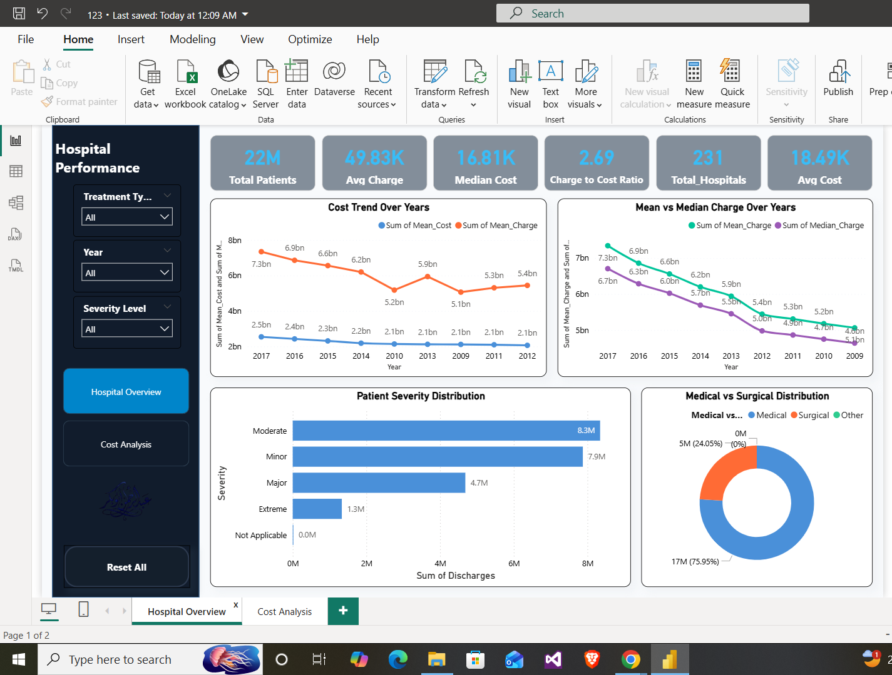
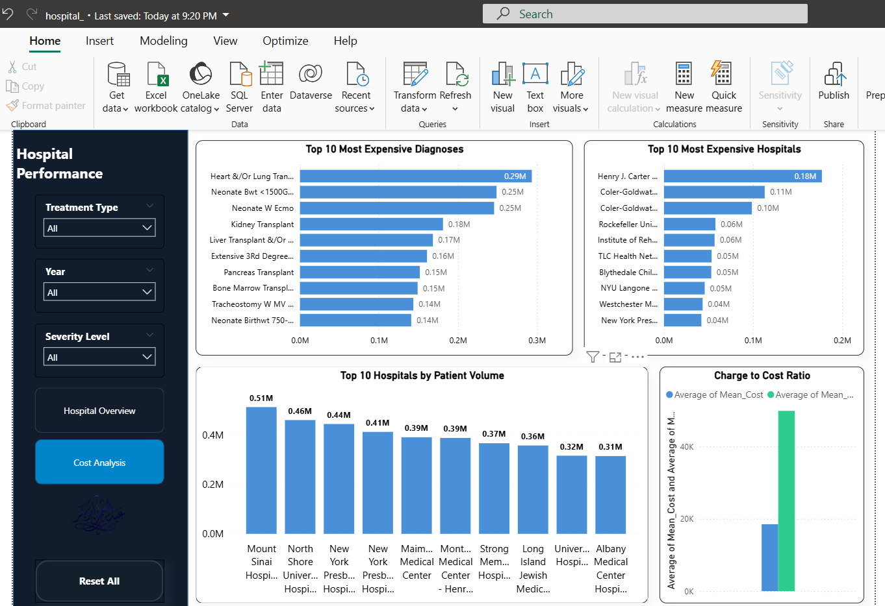

# 🏥 Hospital Cost & Efficiency Analysis (2009–2017)

> Analysis of 21M+ hospital records across 231 New York State hospitals using Python, SQL, Power BI & Excel

---

## 📌 Project Overview

This project analyzes **Hospital Inpatient Cost Transparency Data** from New York State Department of Health, covering the period **2009–2017**. The goal is to uncover insights about healthcare costs, hospital efficiency, and patient distribution to support data-driven administrative decisions.

---

## 🎯 Objectives

- Understand patient distribution and healthcare service patterns
- Uncover the gap between actual costs and billed charges
- Identify the highest-cost hospitals and diagnoses
- Measure the operational efficiency of hospitals
- Provide actionable recommendations for healthcare decision-makers

---

## 📊 Key Findings

| Insight | Value |
|---------|-------|
| Total Patients Analyzed | 21,284,066 |
| Total Hospitals | 231 |
| Average Actual Cost | $18,348 |
| Average Billed Charge | $49,221 |
| Charge to Cost Ratio | **2.69x** |
| Most Expensive Diagnosis | Heart & Lung Transplant ($293K) |
| Most Expensive Hospital | Henry J. Carter Specialty Hospital ($175K) |
| Most Efficient Hospital | Mount Sinai Hospital (488K patients, avg cost) |

---

## 🔍 Analysis Stories

### Story 1 — Patient Volume & Service Distribution
- 76% of admissions are non-critical (Minor or Moderate severity)
- 76% Medical vs 24% Surgical cases
- Extreme cases represent only 6% of total admissions

### Story 2 — The Cost Reality
- Hospitals charge **2.69x** the actual cost of care
- The gap between charges and costs grew **61% vs 37%** from 2009–2017
- Every patient is billed **$30,873 more** than the actual cost

### Story 3 — Where Does the Cost Peak?
- Henry J. Carter charges **4x** the state average
- 8 out of 10 most expensive diagnoses involve organ transplants or critical neonatal cases
- Top 3 hospitals are extreme outliers requiring regulatory attention

### Story 4 — Operational Efficiency
- High patient volume ≠ High cost
- Mount Sinai serves the most patients while maintaining average costs
- Median Charge is more accurate than Mean due to outliers

---

## 🛠️ Tools & Technologies

| Tool | Usage |
|------|-------|
| Python (Pandas, NumPy) | Data Cleaning & EDA |
| Matplotlib & Seaborn | Data Visualization |
| SQLite | SQL Queries & Data Extraction |
| Google Colab | Development Environment |
| Power BI | Interactive Dashboard |
| Excel | Charts & Reporting |
| PowerPoint | Final Presentation |

---

## 📁 Project Files

All project files including Power BI Dashboard, Excel Report, and PowerPoint Presentation are available here:

👉 **[Google Drive — Project Files](https://drive.google.com/drive/folders/15KZSzONCCnLcbnX_UnFKDnsDQcaJq_IN?usp=sharing)**

---

## 📂 Repository Structure

```
Hospital-Cost-Efficiency-Analysis/
│
├── notebook/
│   └── Hospital_Analysis.ipynb      # Python analysis & EDA
│
├── README.md                         # Project documentation
```

---

## 📈 Dashboard Preview

### Hospital Overview Page


### Cost Analysis Page


---

## 💡 Recommendations

1. **Pricing Review** — Specialized hospitals should conduct internal pricing reviews
2. **Pricing Transparency** — Hospitals should disclose costs before treatment
3. **Scale Efficient Models** — Study and replicate Mount Sinai's operational model
4. **Preventive Care Investment** — Redirect resources toward primary care
5. **Insurance Coverage** — Expand coverage for high-cost procedures

---

## ⚠️ Limitations

- Data covers **2009–2017** only
- Limited to **New York State**
- Aggregated data — no individual patient records
- No demographic data (age, gender, length of stay)

---

## 👤 Author

**Abdelrahman Abobakr Mostafa**
Data Analyst

[](https://linkedin.com/in/abdo-abobakr-6588383b0)
[](https://github.com/Abdelrahman-Abobaker)

---

## 📄 Data Source

- **Dataset:** Hospital Inpatient Cost Transparency Data
- **Publisher:** New York State Department of Health
- **Available via:** [Kaggle.com](https://kaggle.com)
- **Period:** 2009 – 2017
- **Size:** 1,081,672 records
